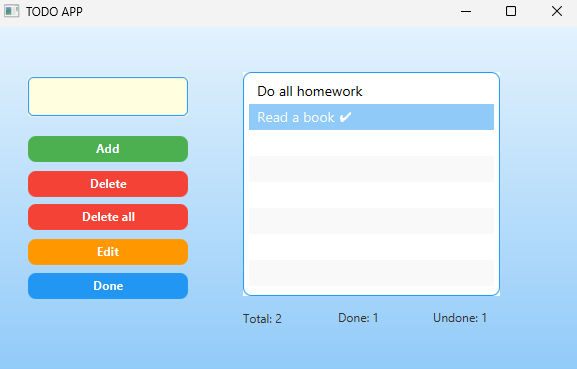

# JavaFX To-Do App

A simple To-Do application built with JavaFX.  
This project was created as a practice project while learning Java.

## Features
- Add new tasks  
- Edit tasks  
- Mark tasks as done  
- Delete single or all tasks  
- Task counters (Total / Done / Undone)  
- Auto save and load tasks from file  

## Screenshot



## Technologies Used
- Java 25 
- JavaFX  
- IntelliJ IDEA

## Future Improvements
- Dark/Light theme
- Persistent database (SQLite) instead of text file
- Better UI design

## How to Run
1. Clone the repository:
   ```bash
   git clone https://github.com/ErnestasCodes/JavaFXToDoproject.git
